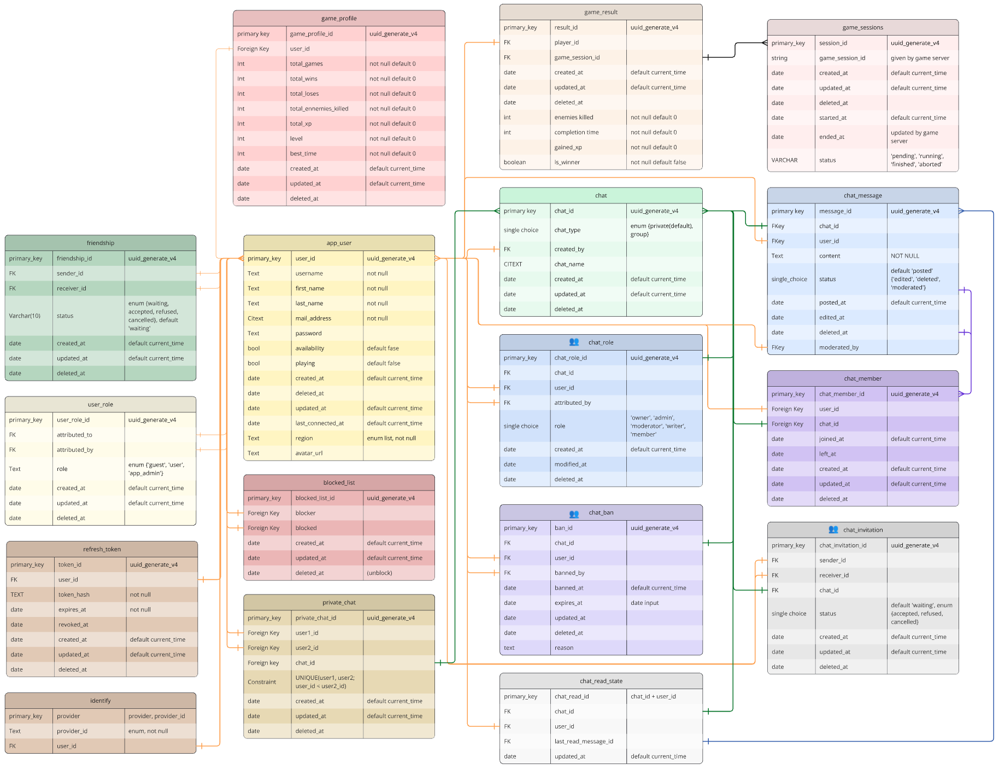

*This project has been created as part of the 42 curriculum by agruet, ndabbous, mprokosc, tpinton and jumichel.*

# FT_TRANSCENDENCE ‒ DungeonNoDragon

## Description

**Project Goal**
Create a web application that deploys a game on the web with a RESTful API and a responsive frontend using React.

**Overview**
This web app allows you to play games with your friends or with random players.

**Key Features**
* A fully integrated rogue-like dungeon crawler experience directly within the platform.
* Advanced chat system including private and organization chats with roles and permissions.
* Profile system with user game statistics and friends.

---

## Instructions

### Prerequisites

* Git
* Linux
* Make
* Docker
* Docker Compose v2

### Environment Setup

Fill in the provided `.env` file located in `./docker/.env`.

Create and fill the required secret files:

```
./docker/secrets/google_secret.txt        Google OAuth secret key
./docker/secrets/secret_42.txt            42 OAuth secret key
./docker/secrets/db_password.txt          PostgreSQL user password
./docker/secrets/pgadmin_password.txt     pgAdmin account password
./docker/secrets/smtp_secret.txt          Brevo secret key
```

### Install, Build, and Run

```
git clone https://github.com/Anicet78/ft_transcendence
cd ft_transcendence
make
```

---

## Resources

* YouTube
	* [Fireship Channel](https://www.youtube.com/@Fireship) → Quick explanations of core concepts
	* [Full backend breakdown video](https://www.youtube.com/watch?v=adOkTjIIDnk)
	* [PostgreSQL full course](https://www.youtube.com/watch?v=zw4s3Ey8ayo)
	* [Socket.io](https://www.youtube.com/watch?v=djMy4QsPWiI)

* Documentation
	* [SDL](https://wiki.libsdl.org/SDL2/CategoryAPIFunction)
	* [Prisma](https://www.prisma.io/docs/orm)

* Tutorials
	* [Beginning Game Programming](https://lazyfoo.net/tutorials/SDL/index.php)
	* [Creating a simple roguelike](https://www.parallelrealities.co.uk/tutorials/rogue/rogue1.php)
	* [Databases](https://www.prisma.io/dataguide/intro/what-are-databases)
	* [PostgreSQL](https://www.w3schools.com/postgresql/index.php)

* Assets
	* [Dungeon Gathering](https://snowhex.itch.io/dungeon-gathering)
	* [Basic Forest Tileset](https://schwarnhild.itch.io/basic-forest-tileset-32x32-pixels)
	* Itch.io
	* [Pixilart](https://www.pixilart.com) ⮕ Create pixel-art assets for the game

* AI Usage
	* Provide easy access to documentation and concept explanations
	* Help explain and solve bugs

---

## Team Information

* **agruet**
	* Roles: *Technical Lead, Developer*
	* Responsibilities: Manage the tech stack, integration, and deployment; backend and frontend development

* **ndabbous**
	* Roles: *Project Manager, Developer*
	* Responsibilities: Organize meetings, distribute tasks, set objectives and deadlines, track project progress; backend and frontend development

* **mprokosc**
	* Roles: *Developer*
	* Responsibilities: Game development and frontend integration

* **tpinton**
	* Roles: *Developer*
	* Responsibilities: Game development and backend integration

* **jumichel**
	* Roles: *Developer*
	* Responsibilities: Website design and frontend development

---

## Project Management

### Work Organization

**Backend (2 devs)**

>⮕ Create the database schema
>⮕ Define all required routes and split the work
>⮕ One developer focused on chat, profiles, and friendships while the other handled authentication, authorization, and security
>⮕ Later joined the frontend due to workload

**Frontend (1 ⮕ 3 devs)**

>⮕ Create the website sketch to map all pages and interactions
>⮕ Build the basic login, register, and home pages
>⮕ Additional developers joined and work was distributed across features
>⮕ Improve UI and responsiveness

**Game (2 devs)**

>⮕ Implement the game engine and deliver an initial v0 early in the project
>⮕ Split the game into server and client
>⮕ Integrate the game into the website

### Project Management Tools

* [GitHub](https://github.com/Anicet78/ft_transcendence)
* [Notion](https://www.notion.so/Transcendence-215512d84c08808c8098dcf170ba7e31?source=copy_link)
* [Miro](https://miro.com/app/board/uXjVGUkRLgU=/?share_link_id=941541403194)

### Communication

* Discord
* [Notion](https://www.notion.so/Transcendence-215512d84c08808c8098dcf170ba7e31?source=copy_link)

---

## Technical Stack

### Frontend

* Language: TypeScript (ESNext) & JSX
* Bundler: Vite (Rollup)
* Framework: React
* Styling framework: Bulma
* Data fetching:
	* TanStack Query
	* Axios
* WebSocket: Socket.io

### Backend / API

* API type: REST
* Language: TypeScript (ESNext)
* Runtime: Node.js
* Framework: Fastify
* Type provider: TypeBox
* Hashing: Argon2
* WebSocket: Socket.io
* Documentation: Swagger

### Database

* System: PostgreSQL
* ORM: Prisma

### Game

**Client**
* Language: C++
* Library: SDL2
* Compiler: Emscripten
* Runtime: WebAssembly
* WebSocket: JavaScript

**Server**
* Language: C++
* WebSocket: uWebSockets
* HTTP Client: libcurl

<br>

**Technical Choices Justification**

>**⮕ Backend:** We chose TypeScript for its popularity, employability, and developer efficiency. Fastify was selected for its performance and growing ecosystem.
>**⮕ Frontend:** TypeScript was also chosen for the frontend since JavaScript is the dominant language for modern web apps. React was selected due to its popularity and strong community support.
>**⮕ Game:** The game was written in C++ and compiled to WebAssembly to run natively in the browser. SDL2 was chosen for its minimalistic approach. However, this decision required us to re-implement the entire game engine, which was time-consuming.
>**⮕ Database:** A SQL database ensures strong data integrity and powerful querying capabilities. PostgreSQL was selected for its advanced open-source features, scalability, and support for complex data types.

---

## Database Schema



### Structure Overview

The database has been designed to maximize unique information sources, with minimal concessions for query optimization.

---

## Features List

| Feature             | Description                             | Contributor(s)     |
|:-------------------:|:---------------------------------------:|:------------------:|
| **Profile**         | Complete profile system                 | ndabbous, jumichel |
| **Friendships**     | Friend request system                   | ndabbous           |
| **Private chat**    | Private conversations with friends      | ndabbous           |
| **Organizations**   | Public chats with role management       | ndabbous           |
| **Search Bar**      | Search users with filters and sorting   | ndabbous           |
| **Rooms**           | Play game with your friends             | agruet             |
| **Auth**            | Login, register and use your account    | agruet, jumichel   |
| **Rogue-like game** | Multiplayer dungeon crawler PvE game    | tpinton, mprokosc  |
| **Game server**     | Handle game clients and synchronization | mprokosc, tpinton  |

---

## Modules

| Module                            | Type  | Justification                            | Implementation                               | Contributor(s)             |
|:---------------------------------:|:-----:|:----------------------------------------:|:--------------------------------------------:|:--------------------------:|
| **User interactions**             | Major | Essential for our project's scope        | Webapp pages and components                  | ndabbous                   |
| **Real-time features**            | Major | Essential for a good chat                | Chat and rooms                               | ndabbous, agruet           |
| **Frameworks for front and back** | Major | Use modern technologies                  | React and Fastify                            | ndabbous, agruet, jumichel |
| **ORM for the database**          | Minor | Add security and readability to requests | Prisma                                       | ndabbous                   |
| **User management**               | Major | Essential for our project's scope        | Update profile informations                  | jumichel, ndabbous         |
| **Web-based game**                | Major | Essential for our project's scope        | 2D dungeon crawler game                      | tpinton, mprokosc          |
| **Remote players**                | Major | Essential for our game idea              | Server communication through websockets      | tpinton, mprokosc          |
| **Multiplayer game**              | Major | Essential for our game idea              | Server communication through websockets      | tpinton, mprokosc          |
| **Advanced chat**                 | Minor | Better user experience                   | As defined in the subject                    | ndabbous                   |
| **Organizations**                 | Major | Better user experience                   | Enhanced public chat with permissions        | ndabbous                   |
| **Advanced permissions**          | Major | Answer to the organization module        | Organization chats                           | ndabbous                   |
| **User activity analytics**       | Minor | Better user experience                   | Public profile analytics                     | tpinton                    |
| **Remote authentication**         | Minor | Better user experience                   | Register or login with google or 42 accounts | agruet                     |
| **Notifications**                 | Minor | Better user experience                   | Pop up on some actions                       | agruet                     |
| **Search**                        | Minor | Essential for our project's scope        | Search Bar to search users                   | jumichel                   |
| **Custom module**                 | Major | See below                                | See below                                    | tpinton, mprokosc          |
| **Total**                         | 26    |                                          |                                              |                            |

<br>

#### Module of choice

**C++ game compiled in WebAssembly and integrated in the website**

>* **Why we chose this module:**
>We wanted to bridge the gap between high-performance native programming and the web. By choosing C++, we leverage a language known for its manual memory management and execution speed, providing a "gaming" experience with SDL2 that feels fluid and responsive, far beyond what standard DOM manipulation could offer.

>* **What technical challenges it addresses:**
>Integrating C++ into a web environment involves several complex layers:
>* Engine Architecture: We didn't just code a game; we re-implemented a lightweight game engine using SDL2, managing the game state and rendering logic manually.
>* Compilation Pipeline: Setting up Emscripten to compile C++ code into .wasm and .js glue code.
>* Memory Management: Handling the memory bridge between the JavaScript sandbox and the WebAssembly linear memory.
>* Cross-Language Communication: Implementing efficient "bindings" to allow JavaScript to trigger game events and vice versa.
>* Asset Management: Loading textures or game data within the constraints of a browser's asynchronous environment.

>* **How it adds value to your project:**
>It brings native-grade performance to the web. By bypassing the limitations of JavaScript's overhead, we provide a lag-free experience with consistent frame rates. This module proves that the project can handle computationally expensive tasks (like complex collision detection or entity management) by offloading them to a highly optimized WebAssembly binary. It demonstrates a deep understanding of how software interacts with hardware, even through a browser layer.

>* **Why it deserves Major module status:**
>This isn't just a simple script; it requires a completely different development environment and toolchain compared to the rest of the stack. It solves the architectural challenge of embedding a high-performance binary within a modern web frontend without sacrificing load times or UX.

---

## Individual Contributions

<!-- Everyone individually fill this -->

#### agruet

* Implemented:
* Modules handled:
* Challenges faced:
* Solutions:

#### ndabbous

* Implemented:
* Modules handled:
* Challenges faced:
* Solutions:

#### mprokosc

* Implemented:
* Modules handled:
* Challenges faced:
* Solutions:

#### tpinton

* Implemented:
* Modules handled:
* Challenges faced:
* Solutions:

#### jumichel

* Implemented:
* Modules handled:
* Challenges faced:
* Solutions:

---

## Credits

**Thanks to Snowhex and Schwarnhild for their free textures**

[Snowhex's dungeon textures](https://snowhex.itch.io/dungeon-gathering)
[Schwarnhild's forest textures](https://schwarnhild.itch.io/basic-forest-tileset-32x32-pixels)
